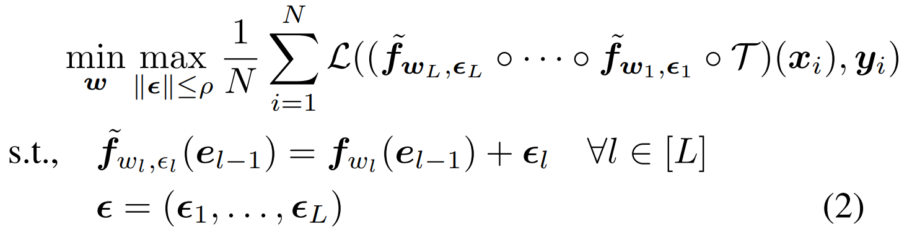

<script type="text/javascript" async
  src="https://cdnjs.cloudflare.com/ajax/libs/mathjax/2.7.9/MathJax.js?config=TeX-MML-AM_CHTML">
</script>

<div class="columns is-centered has-text-centered">
    <div class="column is-four-fifths">
        <h2>Abstract</h2>
        <div class="content has-text-justified">
The new paradigm of finetuning-as-a-service introduces a new attack surface for Large Language Models (LLMs): a few harmful data uploaded by users can easily trick the finetuning to produce an alignment-broken model. We conduct an empirical analysis and uncover a \textit{harmful embedding drift} phenomenon, showing a probable cause of the alignment-broken effect. Inspired by our findings, we propose Vaccine, a perturbation-aware alignment technique to mitigate the security risk of users  finetuning. The core idea of Vaccine is to produce invariant hidden embeddings by progressively adding crafted perturbation to them in the alignment phase. This enables the embeddings to withstand harmful perturbation from  un-sanitized user data in the finetuning phase. Our results on open source mainstream LLMs (e.g., Llama2, Opt, Vicuna) demonstrate that Vaccine can boost the robustness of alignment against harmful prompts induced embedding drift while reserving reasoning ability towards benign prompts. 
        </div>
    </div>
</div>

---

## Harmful fine-tuning issue

<p align="middle">
  
</p>

The figure demonstrate the risk for fine-tuning-as-a-service business model. At the first stage of the service pipeline, the model is safety aligned with safety alignment data. At the second stage, users upload data for service provider to finetune, and the service provider finetune model on user data to deliver custoomized service. However, the user data may contain harmful demonstration data that may subverts the previous enforced alignment. Finetuning on this partially harmful data and deploy the alignment-broken fine-tuned model may cause serious ethical and governance concern.    


## Harmful Embedding Drift
<p align="middle">
  
</p>


1. **Harmful Score**. Figure (a) shows that for the model produced by vanilla scheme (SFT), the alignment loss is increased when the harmful ratio becomes larger. This partially explains
that the model is less aligned to the alignment data after finetuning on more harmful user data, i.e., it starts to forget the alignment knowledge.
2. **Alignment loss**. To futher analyze the cause of forgetting, the left of Figure (b) shows the statisitc of alignment loss. Here alignment loss refers to the loss over the alignment data. The left of Figure (b) indicate that  alignment loss is increased with larger harmful ratio, with the same trend of the harmful score. 
3. **Harmful embedding drift**. To futher analyze the cuase of increase alignment loss, the right of Figure (b)  show the statisitc of embedding drift in different harmful ratio.  Embedding drift refers to the L2 norm of the difference between the hidden embedding of the aligned model (or pre-trained model for Non-aligned) and that of the finetuned model over the same alignment data. The result show a similar increase trend of embedding drift, which seems to indicate that the the embedding drift cause by the harmful data is the cause of increase alignment loss, and subsequently leading to the increase of harmful score. 


## Vaccine: perturbation-aware alignment 
Inspired by the above observation, we try improve the aligned model's immunization to the harmful embedding drift. To achieve this goal, we try to solve this problem in the alignment stage:
<p align="middle">
  
</p>
where $\tilde{\bm f}_{\bm w_l, \bm \epsilon_l}(\bm e_{l-1})$ is the $l$-th layer in a LLM that maps the input to a perturbed embedding and $\mathcal{T}(\bm x_i)$ is the tokenizer function that produces embedding $\bm e_{i,0}$.  In the inner maximization function, we aim to find the perturbation $\bm \epsilon \in \mathbb{R}^d$ over each layer's hidden embedding that maximizes the loss over alignment data. To formulate a meaningful perturbation, we constrain the perturbation to be L2-norm bounded by intensity $\rho$.  In the outer minimization, we optimize the model weights that can withstand such an adversarial perturbation, such that the model is robust to the real harmful perturbation that might be introduced in the later user finetuning stage.  


## Results
Vaccine can significantly reduce the impact of harmful fine-tuning while still able to learn the knowledge of the customized task. 

### Quantitative Results

Comparison of Vaccine and other baselines when facing different ratio of harmful data (p) mixed in the finetuning stage. Vaccine is able to maintain low harmful score while at the same time remaining good finetune accuracy. 

### Qualitative Results

Models aligned by Vaccine, even finetuned on partial harmful data, can still give refusal answer to harmful prompt. 


## Citation
```
@article{huang2024vaccine,
  title={Vaccine: Perturbation-aware alignment for large language model},
  author={Huang, Tiansheng and Hu, Sihao and Liu, Ling},
  journal={arXiv preprint arXiv:2402.01109},
  year={2024}
}
```
